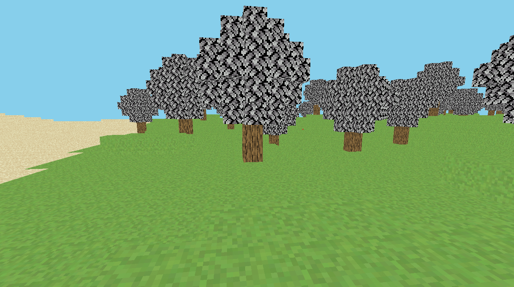
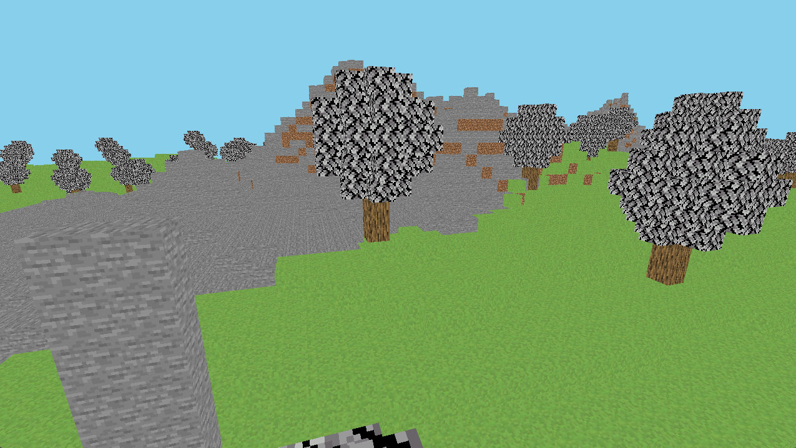

# Minecraft

A small Minecraft-style voxel project written in C++ and OpenGL. This started as a renderer/world-generation exercise and grew into a playable little sandbox with procedural terrain, chunk streaming, block interaction, and basic player physics.

## Screenshots

## Features

- Procedural voxel terrain built from layered FastNoiseLite noise.
- Multiple terrain styles, including plains, deserts, and mountain areas.
- Chunk-based world storage using 16 x 64 x 16 chunks.
- Render-distance based chunk loading and unloading around the player.
- Background chunk generation with a worker thread so the main loop can keep rendering.
- Chunk meshing that only emits visible block faces, including checks across neighboring chunk borders.
- Separate render meshes and textures for grass, dirt, sand, stone, logs, and leaves.
- Simple tree generation in grass biomes.
- First-person camera with mouse look.
- Player movement with gravity, jumping, crouch movement, and block collision.
- Raycast block editing: left click breaks blocks, right click places stone.
- Lightweight OpenGL renderer wrappers for shaders, textures, vertex arrays, vertex buffers, and index buffers.

## Systems

The world is split into chunks, and each chunk owns a flat array of block data. Terrain generation fills those chunks column by column using several noise layers for height, biome selection, continentalness, erosion, ridges, and small detail. Surface blocks change by biome, so plains get grass, deserts get sand, and mountain peaks lean into stone.

Rendering is built around chunk meshes. Instead of drawing every cube face, the mesher checks neighboring blocks and only adds faces that are exposed to air. It also checks adjacent chunks, which keeps seams between chunks from drawing unnecessary internal faces when neighboring data is available.

Chunk generation runs separately from the render loop. The application queues missing chunks around the camera, the worker thread builds the block data, and the main thread uploads a limited number of finished meshes per frame. Chunks outside the render distance are removed from the world and renderer data.

The player controller is intentionally simple but functional. Movement is camera-relative, gravity is applied every frame, collisions are tested against the voxel world, and block interaction uses a short raycast from the camera.

## Tech

- C++20
- OpenGL 3.3
- GLFW
- GLAD
- GLM
- FastNoiseLite
- stb_image
- spdlog
- Premake

## Building

This project is set up for Visual Studio on Windows.

1. Make sure `vendor/bin/premake/premake5.exe` exists.
2. Run `GenerateProjects.bat`.
3. Open `Minecraft.sln`.
4. Build and run the `Minecraft` project.

Textures are loaded from the `images` folder, so keep the project layout intact when running the executable.

## Notes

This is still a learning/project build, so the focus is on the core systems rather than being a full game. The main pieces are there: generated terrain, chunks, meshing, player movement, collision, and basic editing.
